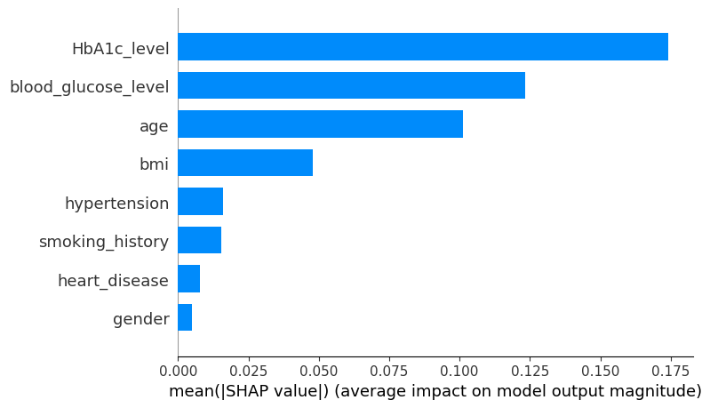

# Модель предсказания диабета - Diabetes Prediction

Данный проект реализован для прогнозирования вероятности диабета на основе 8 клинических показателей. Результатом сявляется реализованное веб-приложение на базе Streamlit, которое запускается в Docker-контейнере.

# Цель проекта:

Разработать модель машинного обучения, способную прогнозировать вероятность наличия диабета у пациента на основе клинических и демографических данных для поддержки ранней диагностики заболевания.

# Данные

Датасет взят из открытого источника https://www.kaggle.com/datasets/iammustafatz/diabetes-prediction-dataset

# Запуск проекта

Запуск приложения streamlit напрямую из проекта:

```
streamlit run ./src/app/app.py
```

Запуска проекта со сборкой образа docker:

```
docker compose up --build
```

Проект автоматически поднимается по порту 8501: `http://localhost:8501`

# Работа с данными

В notebooks `eda.ipynb` описана работа с датасетом. Размер датасета `(100000, 9)`. Всего 8 признаков:
- Пол пациента
- Возраст пациента
- Артериальная гипертензия (наличие)
- Сердечно-сосудистые заболевания (наличие) 
- Курение
- ИМТ
- Гликированный гемоглобин
- Уровень глюкозы в крови

Последний столбец diabetes - целевая переменная: 0 - нет диабета, 1 - есть диабет.
Наличие диабитеа является минорным классом, по размерности в 10 раз меньше мажоритарного класса. 

Наблюдается сильная зависимость целевой переменной от двух показателей: концентрация глюкозы и гликированный гемоглобин, что достаточно для постановки предварительного диагноза. 

# Обучение модели машинного обучения

В notebooks `ML.ipynb` построены 4 модели машинного обучения: логистической регрессии, дерево решений, случайного леса, XGBoost. Были подобраны параметры моделей с помощью GridSearchCV, максимизируя параметр `recall`. 

Основной метрикой качества выбрана Recall, поскольку в задаче прогнозирования диабета критически важно минимизировать количество ложноотрицательных классификаций (False Negative), то есть не пропустить пациентов, действительно имеющих заболевание. При этом дополнительно анализируются метрики Precision, F1-score и ROC-AUC для комплексной оценки качества модели.

Параметры моделй на тренировочной части данных:

| Модель | Accuracy | Precision | Recall | F1-score | ROC-AUC-score |
|--------|----------|-----------|--------|----------|---------------|
| Logistic Regression | 0.8676 | 0.3827 | 0.91 | 0.5388 | 0.9611 |
| Decision Tree | 0.8025 | 0.2981 | 0.9776 | 0.4569 | 0.9606 |
| Random Forest | 0.8984 | 0.4517 | 0.9147 | 0.6048 | 0.9767 |
| XGBoost | 0.8677 | 0.3858 | 0.94 | 0.5471 | 0.9751 |


### Выбор модели:

- Лучшей по Recall показала себя модель Дерева решений, что типично для неё, так как она была оптимизирвоана по метрике Recall. При этом точность самая низкая у этой модели, значит модель упускает около 70% пациентов, которые здоровы, а модель признала их больными. Отсюда следует, что F1-score также самый низкий.
- Случайный лес показывает лучшие показатели по всем метрикам, за исключением Recall. Значение Recall сопоставимо со значением baseline-модели Логистической регрессии. Также случайный лес лучше всех разделеят классы. 
- XGBoost имеет средние значения Recall и F1-score среди всех моделей и в целом уступает случайному лесу. 
Таким образом, итоговой моделью определим Random Forest, которая может быть использована для прогнозирования риска развитися диабета. 

### Feature Importance

С помощью SHAP была определена важность признаков, где подтвердилось, что 2 признака (концентрация глюкозы и гликированный гемоглобин) сильнее всего влияют на принятие решения:


